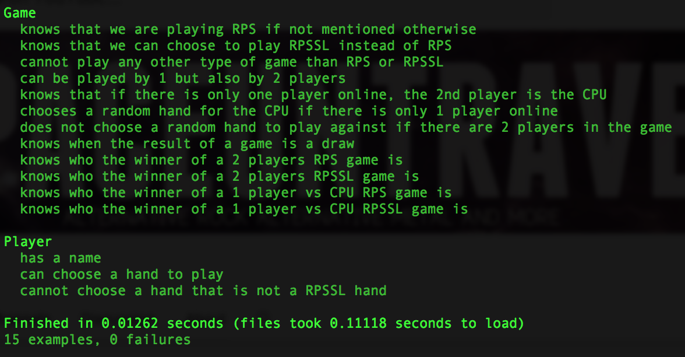

:fist: Rock, Paper, Scissors :v:
===
This is a week end challenge from Makers Academy. The goal was to re-create the Rock, Paper, Scissors game, and also create a web interface to play the game. A bonus to the game was to make it a Rock, Paper, Scissors, Lizard, Spock game.

These were the requested functionalities:
- the player should be able to enter their name before the game
- the player will be presented the choices (rock, paper and scissors)
- the player can choose one option
- the game will choose a random option
- a winner will be declared


Heroku
----
[Link coming soon]()

Objectives of exercise
----
To learn ruby, rspec, capybara, cucumber, sinatra, erb and and deploying an app online using Heroku.

Technologies used
----
- ruby
- rspec, capybara and cucumber
- Sinatra
- erb files
- Git
- Heroku

How to run it
----
```
git clone git@github.com:GBouffard/rps-challenge.git
cd rps-challenge
bundle install
```
You can know play with classes; create players and play Rock-Paper-Scissors and Rock-Paper-Scissors-Spock-Lizard games

How to run tests
----
```
cd rps-challenge
rspec
```
and this is what you should see


